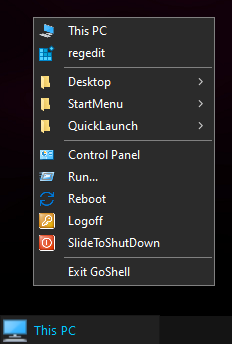

# GoShell
### as minimalistic Windows shell
---

[![Downloads][1]][2] [![GitHub stars][3]][4]

[1]: https://img.shields.io/github/downloads/spddl/GoShell/total.svg
[2]: https://github.com/spddl/GoShell/releases "Downloads"

[3]: https://img.shields.io/github/stars/spddl/GoShell.svg
[4]: https://github.com/spddl/GoShell/stargazers "GitHub stars"

## Rant
This is more of a personal project because the Windows shell has always annoyed me, it has limited capabilities and offers very little customization. With each new version of Windows, the shell is changed from the ground up without adding any value. Each time features are added that no one wanted and usable features are removed. In between we had tiles and a start menu that filled the whole monitor. Now we have weather with Cortana/Bing in the taskbar and widgets again like in Windows Longhorn and we can't even group items in the taskbar without third-party tools.


## Goal
The goal of this shell is to build something similar to how [Litestep](http://www.litestep.net) ([deviantArt](https://www.deviantart.com/search?q=Litestep)) & [Emerge Desktop](http://web.archive.org/web/20140208033302/http://www.emergedesktop.org/) ([deviantArt](https://www.deviantart.com/emergedesktop)) used to be. At the same time to need less resources than the default shell. To do this, the default Windows shell must be replaced and thus many Windows features are not available, everyone must know for themselves whether it is worth it.

Because the functions of the Explorer.exe are not publicly documented I can only use what other developers have already found out. So it's not about achieving the same feature set as the default shell just the absolute minimum.

For those who need a clock or display more, [Rainmeter](https://www.rainmeter.net/) ([deviantArt](https://www.deviantart.com/rainmeter/gallery/)) may be an option.


## How is it used?
- copy the `GoShell.exe` together with the `config.yaml` into a folder of your choice
- start `GoShell.exe` now 2 RegFiles are created: `Set_GoShell.reg` & `Set_Windows_Default_ExplorerShell.reg` this determines which shell should be started at login
- take a look at the `config.yaml` and adjust it if needed
- Restart/Re-login

> Now you can right-click on the desktop to open your context menu with your items and with the middle mouse button your open programs.



# config.yaml

the configuration is written in [Yaml](https://en.wikipedia.org/wiki/YAML), if you want to check your configuration there is [Online YAML Validator](https://www.yamllint.com/).

In the configuration there are four groups "Desktop", "Taskbar", "Contextmenu" and "Hotkey".

## Desktop Syntax

```yaml
desktop:
  contextmenu:
    darkMode: true
    addDebugEntry: true
```

## parameters

### `[optional, default: false] contextmenu/darkMode`

Type: <b>bool</b>

gives the possibility to use the dark mode for the context menu of GoShell

### `[optional, default: false] addDebugEntry`

Type: <b>bool</b>

adds the item "Exit GoShell" to the end of the context menu

## Taskbar Syntax

```yaml
taskbar:
  height: 30
  position: top
  iconPosition: center
  fontFamily: "Segoe UI"
  fontSize: 17
  button:
    size:
      width: 160
      height: 30
    bgcolor:
      r: 32
      g: 32
      b: 32
    textcolor:
      r: 0
      g: 195
      b: 255
  bgcolor:
    r: 20
    g: 20
    b: 20
```

## parameters

### `[default: 30] height`

Type: <b>int</b>

Is related to the height of the taskbar

### `[optional, default: bottom] position`

Type: <b>string</b>

The value sets if the taskbar should be displayed on top or on the bottom.
possible values: "top", "bottom"

### `[optional, default: left] iconPosition`

Type: <b>string</b>

the value defines if the first taskbar icon should be in the middle or on the left side
possible values: "center", "left"

### `[default: "Segoe UI"] fontFamily`

Type: <b>string</b>

Identifies the Windows font for the taskbar element e.g.: Calibri, Times New Roman, MS Shell Dlg 2, technically any Windows font

### `[default: 9] fontSize`

Type: <b>int</b>

Identifies the font size

### `[default: 160] button/size/width`

Type: <b>int</b>

sets the default width of the item in the taskbar

### `[default: 30] button/size/height`

Type: <b>int</b>

sets the default height of the item in the taskbar

### `[default: 0,0,0] button/bgcolor/(r/g/b)`

Type: <b>int</b>

defines the color in RGB of the background

### `[default: 0,0,0] button/textcolor/(r/g/b)`

Type: <b>int</b>

defines the color in RGB of the text color

### `[default: 0,0,0] bgcolor/(r/g/b)`

Type: <b>int</b>

defines the color in RGB of the taskbar

## Contextmenu Syntax

```yaml
contextmenu:
- name: StartMenu
  path:
  - "%ProgramData%\\Microsoft\\Windows\\Start Menu"
  - FOLDERID_StartMenu
  - FOLDERID_CommonStartMenu

- name: CLSID_Desktop
  openProcess: "%WINDIR%\\explorer.exe"
  args:
  - /select,0x11
```

## parameters

### `name`

Type: <b>string</b>

This is the name that will be displayed in the context menu for this entry, except for "separator, _, ." which will be interpreted as separators in the context menu

### `[Folders] path`

Type: <b>[]string</b>

You can choose to get one or many folders in a submenu,
additionally environment variables can be used or [KNOWNFOLDERID](https://learn.microsoft.com/en-us/windows/win32/shell/knownfolderid#constants) 

### `[Items] createProcess`

Type: <b>string</b>

the file will be executed via [CreateProcessW](https://learn.microsoft.com/en-us/windows/win32/api/processthreadsapi/nf-processthreadsapi-createprocessw) when you click on it, if the icon can be loaded it will be loaded as well.

### `[Items] openProcess`

Type: <b>string</b>

the file will be executed by [default Golang command](https://pkg.go.dev/os/exec#Command) when you click, if the icon can be loaded it will be used.

### `[Items] shellExecute`

Type: <b>string</b>

the file will be executed via [ShellExecuteW](https://learn.microsoft.com/en-us/windows/win32/api/shellapi/nf-shellapi-shellexecutew) when you click on it, if the icon can be loaded it will be loaded as well.

### `[Items, optional, default: []] args`

Type: <b>[]string</b>

if arguments are needed they can be specified here as array

### `[Items, optional, default: false] hidden`

Type: <b>bool</b>

if True is set then the program is not displayed

### `[Items, optional] icon\filename`

Type: <b>string</b>

if another icon is to be used, it is specified here with an index.

### `[Items, optional] icon\index`

Type: <b>int</b>

here comes the necessary index where the icon is found

## Hotkey Syntax

```yaml
hotkey:
- buttons: WIN+R
  openProcess: rundll32.exe
  args:
  - shell32.dll,#61

- buttons: WIN+SHIFT+S
  openProcess: SnippingTool.exe
```

## parameters

### `buttons`

Type: <b>string</b>

Hotkeys are separated with a "+". The modifier can be "WIN, ALT, CTRL or SHIFT" with an additional virtual key code.

### `[Items] createProcess`

Type: <b>string</b>

same as above in ContextMenu

### `[Items] openProcess`

Type: <b>string</b>

same as above in ContextMenu

### `[Items] shellExecute`

Type: <b>string</b>

same as above in ContextMenu

### `[Items, optional, default: []] args`

Type: <b>[]string</b>

same as above in ContextMenu

### `[Items, optional, default: false] hidden`

Type: <b>bool</b>

same as above in ContextMenu